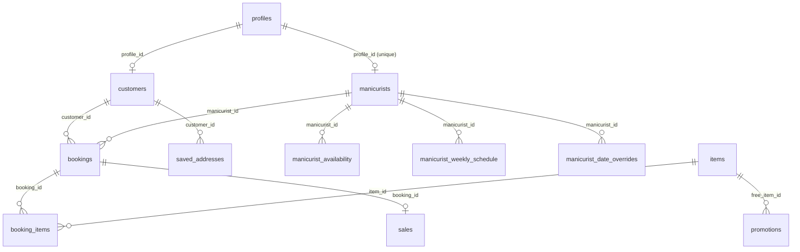

# Database Documentation — Polish Me Up

This document describes the Supabase (PostgreSQL) schema for this project: every table, column, enum, function, trigger, RLS policy, storage bucket, and seed step — with enough SQL to stand the whole thing back up in a fresh Supabase project.

## 0. How this document was assembled (read this first)

The schema was **not** built entirely through committed migrations. The original tables, enums, and RLS policies were created by hand in the Supabase SQL Editor during initial development, and only later changes were captured as files under [`supabase/migrations/`](supabase/migrations/). That means two different confidence levels apply to the SQL in this document:

- **✅ Verified** — copied verbatim from a committed migration file, or read directly from the generated `types/database.types.ts` (which Supabase generates from the live database, so column names/types/nullability/foreign keys there are ground truth as of the last `supabase gen types` run).
- **⚠ Reconstructed** — the object exists in the live database (per a since-deleted `ARCHITECTURE.md` — its still-relevant content has been folded into this document, notably §5.13/5.14 and §11 — and app code that depends on it) but its exact SQL was never committed. What's shown here is a best-effort reconstruction that matches the documented behavior. **Confirm against the live project before relying on it verbatim** (see §10 for how).

Before you build on this doc, close that gap for good:

```bash
supabase login
supabase link --project-ref xzkmcnqetvkpxhdvevow
supabase db dump --schema public > supabase/schema_dump.sql
```

That produces the real, complete `CREATE TABLE`/`CREATE POLICY`/`CREATE FUNCTION` statements from the live database. Commit that dump (or fold it into a new baseline migration) so the next person doesn't have to reconstruct anything.

## 1. Stack summary

- **Database & Auth:** Supabase (PostgreSQL + Auth + Storage)
- **Client SDK:** `@supabase/ssr`, used via three wrappers:
  - [`lib/supabase/client.ts`](lib/supabase/client.ts) — browser client (Client Components)
  - [`lib/supabase/server.ts`](lib/supabase/server.ts) — server client (Server Components / Route Handlers)
  - [`lib/supabase/middleware.ts`](lib/supabase/middleware.ts) — cookie refresh helper used from `proxy.ts`
- **Generated types:** [`types/database.types.ts`](types/database.types.ts) — regenerate after every schema change (§10)
- **Required env vars** (see [`.env.example`](.env.example)):
  | Variable | Used where | Notes |
  |---|---|---|
  | `NEXT_PUBLIC_SUPABASE_URL` | client + server | Project URL |
  | `NEXT_PUBLIC_SUPABASE_PUBLISHABLE_KEY` | client + server | New-format publishable key (`sb_publishable_...`), safe for the browser |
  | `SUPABASE_SECRET_KEY` | server only | New-format secret key (`sb_secret_...`) — never expose to the browser |

## 2. Entity-relationship overview



11 tables in the `public` schema: `profiles`, `customers`, `manicurists`, `manicurist_availability`, `manicurist_weekly_schedule`, `manicurist_date_overrides`, `items`, `bookings`, `booking_items`, `sales`, `promotions`, `saved_addresses`.

(That's 12 — `ARCHITECTURE.md` predates `manicurist_weekly_schedule`, `manicurist_date_overrides`, and `saved_addresses`, which were added by later migrations.)

## 3. Extensions

Supabase projects enable `pgcrypto` by default, which provides `gen_random_uuid()` — every table below uses it as its primary-key default. No manual `create extension` step is needed on a standard Supabase project.

## 4. Enum types ✅ (from `types/database.types.ts`)

```sql
create type public.user_role       as enum ('customer', 'manicurist');
create type public.record_source   as enum ('system', 'manual');
create type public.item_category   as enum ('package', 'addon');
create type public.location_type   as enum ('home', 'booth', 'other');
create type public.discount_type   as enum ('student', 'loyalty', 'none');
create type public.booking_status  as enum ('pending', 'confirmed', 'in_progress', 'completed', 'cancelled');
create type public.payment_status  as enum ('unpaid', 'paid', 'refunded');
create type public.promotion_type  as enum ('student', 'loyalty', 'seasonal');
create type public.service_mode    as enum ('mobile', 'walkin', 'both'); -- added 2026-05-13
```

## 5. Tables

### 5.1 `profiles` — extends `auth.users` ⚠ base table reconstructed

One row per authenticated user (both customers and manicurists). Populated automatically on signup by the `handle_new_user` trigger (§6).

```sql
create table public.profiles (
  id          uuid primary key references auth.users(id) on delete cascade,
  full_name   text,
  email       text,
  phone       text,
  role        public.user_role not null default 'customer',
  is_student  boolean default false,
  created_at  timestamptz default now()
);

alter table public.profiles enable row level security;
```

### 5.2 `customers` ⚠ base table reconstructed

A customer's booking profile. `profile_id` is nullable because manicurists can hand-create a "manual" customer (walk-in, phone booking) that has no auth account.

```sql
create table public.customers (
  id             uuid primary key default gen_random_uuid(),
  profile_id     uuid references public.profiles(id),
  full_name      text not null,
  email          text,
  phone          text,
  is_student     boolean default false,
  first_visit    timestamptz,
  last_visit     timestamptz,
  total_visits   integer default 0,
  total_spent    numeric default 0,
  points_balance integer default 0,
  source         public.record_source default 'system',
  notes          text,
  created_at     timestamptz default now()
);

alter table public.customers enable row level security;
```

> ⚠ **Known gap (from `ARCHITECTURE.md` §9):** the app does a read-modify-write on `total_visits`/`total_spent` after each booking, so two concurrent bookings for the same customer can lose an increment. Fix with an `update ... set total_visits = total_visits + 1` statement or a trigger before relying on these columns for anything financial.

### 5.3 `manicurists` ⚠ base table + ✅ unique constraint

```sql
create table public.manicurists (
  id           uuid primary key default gen_random_uuid(),
  profile_id   uuid not null references public.profiles(id),
  bio          text,
  specialties  text[],
  rating       numeric default 5.0,
  total_jobs   integer default 0,
  photo_url    text,
  is_active    boolean default true,
  created_at   timestamptz default now()
);

alter table public.manicurists enable row level security;

-- ✅ added by supabase/migrations/20260513120000_manicurists_profile_unique.sql
-- Prevents a double-tap / race from creating two manicurists rows for one profile.
alter table public.manicurists
  add constraint manicurists_profile_id_unique unique (profile_id);
```

### 5.4 `manicurist_availability` ⚠ base table reconstructed

Per-slot availability. In practice this table has been superseded by the weekly-schedule + date-override model below (§5.5/5.6), but it still exists in the live schema — check whether the app still writes to it before assuming it's authoritative.

```sql
create table public.manicurist_availability (
  id            uuid primary key default gen_random_uuid(),
  manicurist_id uuid not null references public.manicurists(id),
  date          date not null,
  start_time    time not null,
  end_time      time not null,
  is_booked     boolean default false,
  created_at    timestamptz default now(),
  constraint manicurist_availability_unique unique (manicurist_id, date, start_time)
);

alter table public.manicurist_availability enable row level security;
```

### 5.5 `manicurist_weekly_schedule` ✅ verbatim

Recurring weekly working hours per manicurist. Supports multiple time windows per weekday (e.g. split morning/afternoon shifts).

```sql
-- supabase/migrations/20260513000000_service_mode_geo_schedule.sql
create table public.manicurist_weekly_schedule (
  id              uuid primary key default gen_random_uuid(),
  manicurist_id   uuid not null references public.manicurists(id) on delete cascade,
  weekday         smallint not null check (weekday between 0 and 6), -- 0 = Sunday … 6 = Saturday (JS getDay)
  start_time      time not null,
  end_time        time not null,
  is_closed       boolean not null default false,
  created_at      timestamptz default now(),
  constraint weekly_schedule_time_order check (start_time < end_time)
);

alter table public.manicurist_weekly_schedule enable row level security;
```

> ✅ **Note:** this table originally shipped with `constraint weekly_schedule_unique_day unique (manicurist_id, weekday)`, restricting each manicurist to one window per weekday. `supabase/migrations/20260513160000_multi_window_schedule.sql` dropped it (`alter table public.manicurist_weekly_schedule drop constraint if exists weekly_schedule_unique_day;`) to allow multiple windows per day. **Don't add that constraint back in a fresh setup.**

### 5.6 `manicurist_date_overrides` ✅ verbatim

Per-date overrides on top of the weekly schedule (holidays, sick days, one-off hours).

```sql
-- supabase/migrations/20260513000000_service_mode_geo_schedule.sql
create table public.manicurist_date_overrides (
  id              uuid primary key default gen_random_uuid(),
  manicurist_id   uuid not null references public.manicurists(id) on delete cascade,
  date            date not null,
  is_closed       boolean not null default true,
  start_time      time,
  end_time        time,
  note            text,
  created_at      timestamptz default now(),
  constraint date_override_unique unique (manicurist_id, date),
  constraint date_override_times check (
    is_closed or (start_time is not null and end_time is not null and start_time < end_time)
  )
);

alter table public.manicurist_date_overrides enable row level security;
```

### 5.7 `items` ⚠ base table + ✅ later columns

Bookable packages and add-ons.

```sql
create table public.items (
  id            uuid primary key default gen_random_uuid(),
  name          text not null,
  category      public.item_category not null,
  description   text,
  price         numeric not null,
  cost          numeric,
  margin        numeric,                      -- price − cost; see note below
  stock         integer,
  photo_url     text,                         -- legacy single-image column
  duration_min  integer,
  is_active     boolean default true,
  created_at    timestamptz default now(),

  -- ✅ added by supabase/migrations/20260513140000_item_photos.sql
  photo_urls    text[] not null default '{}', -- up to 3 images per item; supersedes photo_url

  -- ✅ added by supabase/migrations/20260513000000_service_mode_geo_schedule.sql
  service_mode  public.service_mode not null default 'both'
);

alter table public.items enable row level security;

create index items_service_mode_active_idx
  on public.items (service_mode, is_active);
```

> **Note on `margin`:** `ARCHITECTURE.md` originally described this as a Postgres `GENERATED ALWAYS AS (price - cost) STORED` column. However, `types/database.types.ts` lists it as a plain writable field in `Insert`/`Update`, which generated columns normally are not — so either the design changed, or it's computed in the app instead of the database. Verify with `supabase db dump` before assuming either way.

### 5.8 `bookings` ⚠ base table + ✅ later columns

```sql
create table public.bookings (
  id               uuid primary key default gen_random_uuid(),
  booking_number   text unique,
  customer_id      uuid not null references public.customers(id),
  manicurist_id    uuid references public.manicurists(id),   -- nullable: historical/manual bookings
  booking_date     date not null,
  booking_time     time,
  location_type    public.location_type not null default 'home',
  address          text,
  notes            text,
  subtotal         numeric not null,
  discount_amount  numeric default 0,
  discount_type    public.discount_type default 'none',
  total            numeric not null,
  status           public.booking_status default 'pending',
  payment_status   public.payment_status default 'unpaid',
  source           public.record_source default 'system',
  created_at       timestamptz default now(),
  updated_at       timestamptz default now(),

  -- ✅ added by supabase/migrations/20260513000000_service_mode_geo_schedule.sql
  service_mode     public.service_mode,
  address_lat      numeric(10, 7),
  address_lng      numeric(10, 7)
);

alter table public.bookings enable row level security;

-- ✅ verbatim: service_mode may only be 'mobile' or 'walkin' at the booking level
-- ('both' is only valid on items, meaning "bookable either way").
-- Existing rows were backfilled: location_type = 'booth' → 'walkin', else → 'mobile'.
alter table public.bookings
  add constraint bookings_service_mode_not_both
  check (service_mode in ('mobile', 'walkin'));
```

> ⚠ **Known gap (from `ARCHITECTURE.md` §9):** `subtotal`/`discount_amount`/`total` are calculated client-side (`lib/utils/calculateDiscount.ts`) and trusted on insert — there's no server-side recalculation. The per-line `unit_price` snapshot in `booking_items` is the only audit trail. Move pricing into a Route Handler/Server Action before adding real payments.

### 5.9 `booking_items` ✅ from types

Line items for a booking, with a price snapshot at time of booking (so later catalog price changes don't rewrite history).

```sql
create table public.booking_items (
  id          uuid primary key default gen_random_uuid(),
  booking_id  uuid not null references public.bookings(id),
  item_id     uuid not null references public.items(id),
  quantity    integer not null default 1,
  unit_price  numeric not null,
  subtotal    numeric not null
);

alter table public.booking_items enable row level security;
```

### 5.10 `promotions` ⚠ base table reconstructed (defined, unused in MVP)

```sql
create table public.promotions (
  id            uuid primary key default gen_random_uuid(),
  code          text,
  type          public.promotion_type not null,
  discount_pct  numeric,
  free_item_id  uuid references public.items(id),
  min_bookings  integer,
  is_active     boolean default true,
  valid_until   timestamptz
);

alter table public.promotions enable row level security;
```

> Table + RLS exist but there's no UI and no validation wired up. The only discount actually applied anywhere is a hard-coded 10% student rate in `calculateDiscount`.

### 5.11 `sales` ⚠ base table reconstructed

Daily sales ledger, one row per booking (plus manual entries).

```sql
create table public.sales (
  id             uuid primary key default gen_random_uuid(),
  booking_id     uuid references public.bookings(id),
  date           date not null,
  gross_sales    numeric not null default 0,
  refunds        numeric default 0,
  discounts      numeric default 0,
  net_sales      numeric,     -- gross_sales − refunds − discounts; see note on items.margin above
  cost_of_goods  numeric,
  gross_profit   numeric,     -- net_sales − cost_of_goods; same caveat
  source         public.record_source default 'system',
  created_at     timestamptz default now()
);

alter table public.sales enable row level security;
```

### 5.12 `saved_addresses` ✅ verbatim

Per-customer address book (Home/Work/custom labels) for one-click reuse on mobile bookings.

```sql
-- supabase/migrations/20260513180000_saved_addresses.sql
create table public.saved_addresses (
  id          uuid primary key default gen_random_uuid(),
  customer_id uuid not null references public.customers(id) on delete cascade,
  label       text not null
    check (length(trim(label)) between 1 and 30),
  address     text not null,
  lat         numeric(10, 7) not null,
  lng         numeric(10, 7) not null,
  created_at  timestamptz default now(),
  constraint saved_addresses_unique_label unique (customer_id, label)
);

create index saved_addresses_customer_idx
  on public.saved_addresses (customer_id, created_at desc);

alter table public.saved_addresses enable row level security;
```

### 5.13 Business rules: system vs. manual records ⚠ reconstructed

`customers` and `bookings` both carry a `source` (`record_source`: `system` | `manual`). The app validates and defaults each differently — two parallel Zod schemas per entity (strict for customer-facing "system" writes, relaxed for manicurist-entered "manual" ones), enforced in application code, not in the database:

| Field | System booking (customer self-service) | Manual booking (manicurist-entered) |
|---|---|---|
| `booking_date` | must be ≥ today | any past date allowed |
| `manicurist_id` | required | optional |
| `booking_time` | required | optional |
| Availability check | enforced against schedule/overrides | skipped |
| Default `status` | `pending` | `completed` |
| Default `payment_status` | `unpaid` | `paid` |

Because none of this is enforced by a check constraint or trigger, a direct SQL insert (or a future API route) can bypass it entirely — if that becomes a problem, promote the two right-hand rows to real database constraints (e.g. a check constraint tying `source = 'manual'` to relaxed date rules) rather than trusting every call site to apply the app-level schema.

Every analytics/sales query in the app also supports filtering by this same `source` field (All / System / Manual), so it doubles as the audit trail for "did a customer book this, or did staff key it in."

### 5.14 Write-path data flow ⚠ reconstructed (context, not schema)

Not enforced by the database, but useful when writing new code against these tables — the customer booking flow performs these writes as one logical unit (not currently wrapped in an actual Postgres transaction — see the "atomic customer aggregates" gap in §12):

1. Insert one row into `bookings` (status `pending`, payment `unpaid` for a system booking).
2. Insert one row per line item into `booking_items`, snapshotting `unit_price` from `items.price` at that moment.
3. Mark the relevant `manicurist_availability` row `is_booked = true` (or, for the newer schedule model, this is derived from `bookings` rather than written back to `manicurist_weekly_schedule`/`manicurist_date_overrides`).
4. Update the customer's own row: bump `total_visits`, `total_spent`, `last_visit`.

On the manicurist side, moving a booking through `status`: `pending → in_progress → completed` is what's expected to trigger a corresponding `sales` row (`gross_sales`, `cost_of_goods`, etc.) — but per §12, the dashboard currently has no UI for these status transitions, so today this only happens via direct SQL.

## 6. Functions & triggers ⚠ reconstructed

These are referenced throughout the RLS policies and app code but their exact bodies were never committed. The versions below match documented behavior (including a bug fix noted in `ARCHITECTURE.md`) — confirm against the live project (`supabase db dump`) before treating as exact.

```sql
-- Copies auth.users → profiles on signup.
-- IMPORTANT: `set search_path` is required — ARCHITECTURE.md documents that omitting it
-- caused this trigger to fail silently in production. Every SECURITY DEFINER function
-- in this project should set search_path explicitly.
create or replace function public.handle_new_user()
returns trigger
language plpgsql
security definer
set search_path = public, pg_temp
as $$
begin
  insert into public.profiles (id, full_name, email, role)
  values (
    new.id,
    new.raw_user_meta_data ->> 'full_name',
    new.email,
    coalesce((new.raw_user_meta_data ->> 'role')::public.user_role, 'customer')
  );
  return new;
end;
$$;

create trigger on_auth_user_created
  after insert on auth.users
  for each row execute function public.handle_new_user();

-- Used throughout RLS policies to grant manicurists elevated access.
create or replace function public.is_manicurist()
returns boolean
language sql
security definer
set search_path = public, pg_temp
as $$
  select exists (
    select 1 from public.profiles
    where id = auth.uid() and role = 'manicurist'
  );
$$;
```

## 7. Row Level Security policies

RLS is enabled on every table. Two tiers below: the original (base) policy set is reconstructed from `ARCHITECTURE.md`'s documented "final policy list"; the five Phase 7B fixes and everything added afterward are quoted verbatim from committed migrations.

### 7.1 Base policies ⚠ reconstructed (semantics documented, exact SQL not committed)

```sql
-- profiles
create policy "users see own profile" on public.profiles
  for select using (id = auth.uid());
create policy "users update own profile" on public.profiles
  for update using (id = auth.uid());
create policy "manicurists see all profiles" on public.profiles
  for select using (public.is_manicurist());

-- customers
create policy "customers see own record" on public.customers
  for select using (profile_id = auth.uid());
create policy "manicurists manage all customers" on public.customers
  for all using (public.is_manicurist());

-- manicurists
create policy "anyone can see active manicurists" on public.manicurists
  for select using (is_active = true);
create policy "manicurists manage own row" on public.manicurists
  for all using (public.is_manicurist() and profile_id = auth.uid());

-- manicurist_availability
create policy "anyone can read availability" on public.manicurist_availability
  for select using (true);
create policy "manicurists manage own availability" on public.manicurist_availability
  for all using (public.is_manicurist());

-- items
create policy "anyone can read active items" on public.items
  for select using (is_active = true);
create policy "manicurists manage items" on public.items
  for all using (public.is_manicurist());

-- bookings
create policy "customers see own bookings" on public.bookings
  for select using (
    exists (select 1 from public.customers c
            where c.id = bookings.customer_id and c.profile_id = auth.uid())
  );
create policy "customers create own bookings" on public.bookings
  for insert with check (
    exists (select 1 from public.customers c
            where c.id = bookings.customer_id and c.profile_id = auth.uid())
  );
create policy "manicurists manage all bookings" on public.bookings
  for all using (public.is_manicurist());

-- booking_items
create policy "customers see own booking items" on public.booking_items
  for select using (
    exists (select 1 from public.bookings b
            join public.customers c on c.id = b.customer_id
            where b.id = booking_items.booking_id and c.profile_id = auth.uid())
  );
create policy "manicurists manage all booking items" on public.booking_items
  for all using (public.is_manicurist());

-- sales (no customer access at all)
create policy "manicurists manage sales" on public.sales
  for all using (public.is_manicurist());

-- promotions
create policy "manicurists manage promotions" on public.promotions
  for all using (public.is_manicurist());
```

### 7.2 Phase 7B fixes ✅ verbatim

```sql
-- supabase/migrations/20260512120000_rls_customer_flow_fixes.sql

-- 1. The /order page auto-creates a customers row on first visit — needed an INSERT policy.
drop policy if exists "customers create own record" on public.customers;
create policy "customers create own record"
  on public.customers
  for insert
  to authenticated
  with check (profile_id = auth.uid());

-- 2. After a booking, the order page bumps total_visits/total_spent/last_visit on the
--    customer's own row — needed an UPDATE policy.
drop policy if exists "customers update own record" on public.customers;
create policy "customers update own record"
  on public.customers
  for update
  to authenticated
  using (profile_id = auth.uid())
  with check (profile_id = auth.uid());

-- 3. The order form lists manicurists by joining manicurists → profiles for full_name.
--    The default profile SELECT policy only exposed the caller's own row.
drop policy if exists "anyone can read manicurist profiles" on public.profiles;
create policy "anyone can read manicurist profiles"
  on public.profiles
  for select
  using (role = 'manicurist');

-- 4. booking_items had a SELECT policy but no INSERT policy, so line items could
--    never be persisted by a customer.
drop policy if exists "customers insert own booking items" on public.booking_items;
create policy "customers insert own booking items"
  on public.booking_items
  for insert
  to authenticated
  with check (
    exists (
      select 1
      from public.bookings b
      join public.customers c on c.id = b.customer_id
      where b.id = booking_items.booking_id
        and c.profile_id = auth.uid()
    )
  );

-- 5. The original cancel policy had USING but no WITH CHECK. Postgres treats a
--    missing WITH CHECK on UPDATE as "no rows may be produced" — every cancel
--    attempt failed silently. Recreated with both clauses.
drop policy if exists "customers cancel own pending bookings" on public.bookings;
create policy "customers cancel own pending bookings"
  on public.bookings
  for update
  to authenticated
  using (
    status = 'pending'
    and exists (
      select 1 from public.customers c
      where c.id = bookings.customer_id
        and c.profile_id = auth.uid()
    )
  )
  with check (
    status in ('pending', 'cancelled')
    and exists (
      select 1 from public.customers c
      where c.id = bookings.customer_id
        and c.profile_id = auth.uid()
    )
  );
```

> **Lesson baked into the fixes above (from `ARCHITECTURE.md`):** for every table a user can mutate, ship the read policy *and* the matching write policies (INSERT/UPDATE) in the same migration, and always give UPDATE policies both `USING` (checks the existing row) and `WITH CHECK` (checks the new row) — a missing `WITH CHECK` silently blocks every update with no visible error.

### 7.3 `manicurist_weekly_schedule` & `manicurist_date_overrides` ✅ verbatim

```sql
-- supabase/migrations/20260513000000_service_mode_geo_schedule.sql

create policy "anyone can read weekly schedule"
  on public.manicurist_weekly_schedule
  for select
  using (true);

create policy "manicurists manage own weekly schedule"
  on public.manicurist_weekly_schedule
  for all
  to authenticated
  using (
    public.is_manicurist()
    and exists (
      select 1 from public.manicurists m
      where m.id = manicurist_weekly_schedule.manicurist_id
        and m.profile_id = auth.uid()
    )
  )
  with check (
    public.is_manicurist()
    and exists (
      select 1 from public.manicurists m
      where m.id = manicurist_weekly_schedule.manicurist_id
        and m.profile_id = auth.uid()
    )
  );

create policy "anyone can read date overrides"
  on public.manicurist_date_overrides
  for select
  using (true);

create policy "manicurists manage own date overrides"
  on public.manicurist_date_overrides
  for all
  to authenticated
  using (
    public.is_manicurist()
    and exists (
      select 1 from public.manicurists m
      where m.id = manicurist_date_overrides.manicurist_id
        and m.profile_id = auth.uid()
    )
  )
  with check (
    public.is_manicurist()
    and exists (
      select 1 from public.manicurists m
      where m.id = manicurist_date_overrides.manicurist_id
        and m.profile_id = auth.uid()
    )
  );
```

### 7.4 `saved_addresses` ✅ verbatim

```sql
-- supabase/migrations/20260513180000_saved_addresses.sql

create policy "customers manage own saved addresses"
  on public.saved_addresses
  for all
  to authenticated
  using (
    exists (
      select 1 from public.customers c
      where c.id = saved_addresses.customer_id
        and c.profile_id = auth.uid()
    )
  )
  with check (
    exists (
      select 1 from public.customers c
      where c.id = saved_addresses.customer_id
        and c.profile_id = auth.uid()
    )
  );

create policy "manicurists read all saved addresses"
  on public.saved_addresses
  for select
  using (public.is_manicurist());
```

## 8. Storage ✅ verbatim

One public bucket, `service-images`, for item/manicurist photos.

```sql
-- supabase/migrations/20260513140000_item_photos.sql

insert into storage.buckets (id, name, public)
values ('service-images', 'service-images', true)
on conflict (id) do update set public = excluded.public;

create policy "service-images public read"
  on storage.objects
  for select
  using (bucket_id = 'service-images');

create policy "service-images manicurist upload"
  on storage.objects
  for insert
  to authenticated
  with check (bucket_id = 'service-images' and public.is_manicurist());

create policy "service-images manicurist update"
  on storage.objects
  for update
  to authenticated
  using (bucket_id = 'service-images' and public.is_manicurist())
  with check (bucket_id = 'service-images' and public.is_manicurist());

create policy "service-images manicurist delete"
  on storage.objects
  for delete
  to authenticated
  using (bucket_id = 'service-images' and public.is_manicurist());
```

## 9. Seed data

### 9.1 Item catalog ✅ verbatim (current catalog, supersedes any earlier seed)

```sql
-- supabase/migrations/20260513000000_service_mode_geo_schedule.sql
-- Deactivates old items rather than deleting them, so historical booking_items.item_id
-- foreign keys stay valid.
update public.items set is_active = false;

insert into public.items (name, description, category, service_mode, price, duration_min, is_active)
values
  ('Manicure',                'Classic manicure at your location.', 'package', 'mobile', 30.00, 45, true),
  ('Pedicure',                'Classic pedicure at your location.', 'package', 'mobile', 35.00, 50, true),
  ('Mani + Pedi',             'Hands and feet combo.',              'package', 'mobile', 55.00, 90, true),
  ('Mani + Hand Spa',         'Manicure with a relaxing hand spa.', 'package', 'mobile', 60.00, 75, true),
  ('Pedi + Foot Spa',         'Pedicure with a relaxing foot spa.', 'package', 'mobile', 70.00, 90, true),
  ('Manicure (Walk-in)',      'Classic manicure at our booth.',     'package', 'walkin', 25.00, 40, true),
  ('Press-on Nails (Short)',  'Short press-on nail set.',           'addon',   'both',   15.00, 15, true),
  ('Press-on Nails (Medium)', 'Medium press-on nail set.',          'addon',   'both',   30.00, 20, true),
  ('Press-on Nails (Long)',   'Long press-on nail set.',            'addon',   'both',   45.00, 25, true),
  ('Gel',                     'Gel polish application.',            'addon',   'both',   45.00, 30, true),
  ('Nail Kit (Small)',        'Take-home nail care kit, small.',    'addon',   'both',   35.00, 0,  true),
  ('Nail Kit (Large)',        'Take-home nail care kit, large.',    'addon',   'both',   45.00, 0,  true);
```

### 9.2 First manicurist ✅ verbatim ([`supabase/seed_manicurist.sql`](supabase/seed_manicurist.sql))

Run **after** at least one profile has `role = 'manicurist'`:

```sql
-- Promote an account first if needed:
UPDATE profiles SET role = 'manicurist' WHERE email = 'you@example.com';

-- Then create the matching manicurists row:
INSERT INTO public.manicurists (profile_id, bio, specialties, rating, total_jobs, is_active)
SELECT
  p.id,
  'Founder & lead manicurist.',
  ARRAY['gel', 'pedicure', 'nail art']::text[],
  5.0,
  0,
  true
FROM public.profiles p
WHERE p.role = 'manicurist'
  AND NOT EXISTS (
    SELECT 1 FROM public.manicurists m WHERE m.profile_id = p.id
  )
LIMIT 1;
```

## 10. Setting this up in a new Supabase project

1. Create the project, grab the URL + publishable/secret keys, drop them into `.env.local` (copy `.env.example`).
2. Run the SQL in this doc **in order**: §4 (enums) → §5 (tables, in the order listed — each references the previous) → §6 (functions/triggers) → §7 (RLS policies) → §8 (storage) → §9 (seed data).
3. Regenerate types so the app's TypeScript matches the live schema:
   ```bash
   supabase gen types typescript --project-id <your-project-ref> > types/database.types.ts
   ```
4. Promote your own account to `manicurist` and run §9.2 to get a working dashboard login.

### Keeping this document honest going forward

Every ⚠ item above exists because a schema change was made directly against the live database instead of through a migration file. Going forward:

- **Always** add new tables/columns/policies via `supabase migration new <name>` and commit the file, even if you also apply it by hand for a quick fix.
- After any dashboard-only change, immediately run `supabase db dump --schema public` (or `supabase db diff`) and fold the result into a migration — don't let it live only in production.
- Re-run `supabase gen types typescript ...` after any schema change so `types/database.types.ts` (the one source in this repo that's always accurate) stays a reliable cross-check for docs like this one.

## 11. Known limitations (folded in from a since-deleted `ARCHITECTURE.md`, still relevant)

- No real availability/double-booking prevention — the order form allows any 15-minute slot in business hours without checking `manicurist_weekly_schedule`/`manicurist_date_overrides` for conflicts.
- No transactional email (`supabase.auth` email delivery is disabled).
- No manual/historical booking entry UI for manicurists (only manual **customer** entry exists).
- No CSV import wizard (PapaParse is a dependency but unused).
- No merge-on-signup — a manually created customer row doesn't get linked when that person later creates an account.
- `promotions` has a table and RLS but no application logic beyond a hard-coded 10% student discount.
- Booking pricing (`subtotal`/`discount_amount`/`total`) is client-calculated and trusted on insert — no server-side recomputation.
- `customers.total_visits`/`total_spent` updates are read-modify-write from the app, not atomic — concurrent bookings can lose increments.
- No in-app booking status transitions — manicurists can currently only move a booking through `pending → in_progress → completed` via direct SQL; the dashboard has no status-transition controls, which also means the `sales` row that's supposed to correspond to a completed booking (§5.14) isn't created automatically either.
